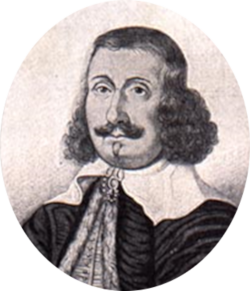

Uber QR Code
============

<p align="center">
    
    <br><br>
    <i>"The next way home's the farthest way about"</i>
</p>


## What for ?

Scanning such a QR code, to quickly open your Uber app with the pre-filled pickup address of your home.


## How to ?

* Go to [QRCode-Monkey](https://www.qrcode-monkey.com/)
* Select the "Text" tab
* Paste the URL below in the textarea
* Replace the latitude, longitude and nickname values
  * nickname is the postal address, separated by the '+' character as whitespace)
* Design your QRcode (optional)
  * Add an Uber [logo](./logo/uber-qr-logo.png)
  * Color the foreground (ex: from #071E28 to #282F99 with radial gradient)
* Download it !

Example:

```
uber://?action=setPickup&pickup[latitude]=53.361552&pickup[longitude]=-6.2112766&pickup[nickname]=9+Haddon+Rd+Dublin
```

> Tip: Google Maps will help you to get the coordinates of your postal address

## Result


