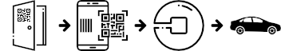

Uber QRCode
===========

*"Fixing an Uber QR code on your front door for home guests or parents-in-law"*

## What for ?

Scanning such a QR code, to quickly open your Uber app with the pre-filled pickup address of your home.



## How to create one ?

* Go to [QRCode-Monkey](https://www.qrcode-monkey.com/)
* Select the "Text" tab
* Copy the example below in the textbox
* Replace the latitude, longitude and nickname (the postal address, separated by a '+')
* Add the [Uber logo](./logo/uber-qr-logo.png)
* Custom design the code
* Custom the foreground color (from #071E28 to #282F99 and select "radial gradient")
* Download the QR code in PNG, SVG

Example:

```
uber://?action=setPickup&pickup[latitude]=53.361552
                        &pickup[longitude]=-6.2112766
                        &pickup[nickname]=9+Haddon+Rd+Dublin
```

> Tip: Google Maps will help you to get the coordinates of your postal address

## Result


